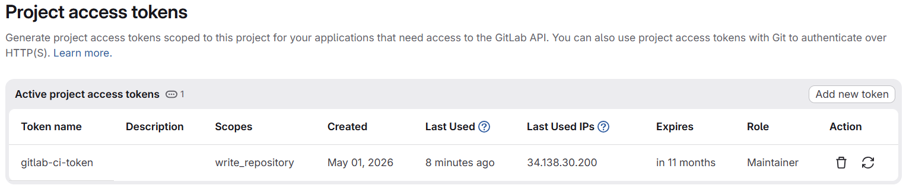
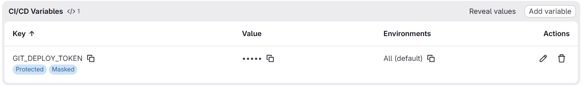

# GitLab CI/CD Pipeline Setup Guide

This document describes all the configuration required **before** your pipeline can run successfully — including CI/CD Variables and the Deploy Token needed for the `update_manifests` stage.

---

## Pipeline Overview

```
test ──► security ──► build ──► deploy
  │           │          │          │
test_backend  sast    build_and   update_
test_frontend secret  _push       manifests
              dep_scan
```

| Stage      | Job(s)                                    | Description                                      |
|------------|-------------------------------------------|--------------------------------------------------|
| `test`     | `test_backend`, `test_frontend`           | Run unit tests with coverage                     |
| `security` | `sast`, `secret_detection`, `dependency_scanning` | GitLab security scan templates              |
| `build`    | `build_and_push`                          | Build Docker images and push to GitLab Registry  |
| `deploy`   | `update_manifests`                        | Update image tags in `k8s/` manifests via `git push` |

---

## ✅ Prerequisites

### 1. Container Registry

The **GitLab Container Registry** must be **enabled** for your project.

> **Settings → General → Visibility, project features, permissions → Container Registry → Enable**

The following predefined variables are **automatically available** — no manual setup needed:

| Variable | Description |
|---|---|
| `CI_REGISTRY` | GitLab Container Registry hostname (e.g. `registry.gitlab.com`) |
| `CI_REGISTRY_IMAGE` | Full image path for the project (e.g. `registry.gitlab.com/user/project`) |
| `CI_REGISTRY_USER` | Username for registry login (ephemeral, valid per job) |
| `CI_REGISTRY_PASSWORD` | Password/token for registry login (ephemeral, valid per job) |

---

## 🔑 Required: Deploy Token (for `update_manifests`)

The `update_manifests` job clones the repo and pushes updated manifest files back to the default branch. This requires a **Deploy Token** with write access.

### Step 1 — Create a Deploy Token

1. Go to your project → **Settings → Repository → Deploy tokens**
2. Click **Add token** and fill in:

   | Field | Value |
   |---|---|
   | **Name** | `ci-manifest-updater` (or any descriptive name) |
   | **Username** | `ci-deploy` *(note this — you'll need it below)* |
   | **Scopes** | ☑ `read_repository` &nbsp; ☑ `write_repository` |

3. Click **Create deploy token**
4. **Copy the generated token value immediately** — it will not be shown again.

---

### Step 2 — Add CI/CD Variables

Go to your project → **Settings → CI/CD → Variables** → **Add variable** for each of the following:

#### Required Variables

| Variable Name | Value | Type | Protected | Masked |
|---|---|---|---|---|
| `CI_DEPLOY_USER` | The **Username** you set in the deploy token (e.g. `ci-deploy`) | Variable | ✅ Yes | ❌ No |
| `GIT_DEPLOY_TOKEN` | The **token value** generated by GitLab | Variable | ✅ Yes | ✅ Yes |





> [!IMPORTANT]
> Both variables **must** be marked **Protected** so they are only available on protected branches (e.g. `main`/`master`). Mark `GIT_DEPLOY_TOKEN` as **Masked** to prevent it from appearing in job logs.

> [!NOTE]
> The `update_manifests` job only runs on the default branch (`$CI_DEFAULT_BRANCH`), so protecting the variables is safe and recommended.

#### How the Token Is Used

The pipeline constructs the push URL as:

```yaml
git remote set-url origin "https://${CI_DEPLOY_USER}:${GIT_DEPLOY_TOKEN}@${CI_SERVER_HOST}/${CI_PROJECT_PATH}.git"
```

---

## 🛡️ Branch Protection

The `update_manifests` job commits directly to the default branch. To prevent pipeline failures, ensure the default branch allows CI bot pushes:

1. Go to **Settings → Repository → Protected Branches**
2. Find your default branch (e.g. `main`)
3. Under **Allowed to push**, select **Developers + Maintainers** (or at minimum allow the deploy token user)

> [!WARNING]
> If the default branch is fully protected (push restricted to maintainers only and deploy tokens excluded), the `git push` in `update_manifests` will fail with a permission error even with a valid token.

---

## 📋 Variable Summary Checklist

Use this checklist before triggering your first pipeline:

```
[ ] GitLab Container Registry is enabled for the project
[ ] Deploy Token created with read_repository + write_repository scopes
[ ] CI_DEPLOY_USER variable added (Protected, value = deploy token username)
[ ] GIT_DEPLOY_TOKEN variable added (Protected + Masked, value = deploy token secret)
[ ] Default branch allows push from the deploy token / CI jobs
[ ] k8s/backend.yaml and k8s/frontend.yaml exist with image fields matching the pattern:
      image: <CI_REGISTRY_IMAGE>/backend:<tag>
      image: <CI_REGISTRY_IMAGE>/frontend:<tag>
```

---

## 🔄 Pipeline Trigger Rules

| Trigger | Stages That Run |
|---|---|
| Push to **default branch** (`main`) | All stages including `update_manifests` |
| Push a **Git tag** (e.g. `v1.0.0`) | All stages including `update_manifests` (uses tag as version) |
| Push to **any other branch** | Pipeline does **not** trigger (blocked by `workflow.rules`) |
| Merge Request | Pipeline does **not** trigger (blocked by `workflow.rules`) |

> [!TIP]
> The image tag is determined automatically:
> - If a **Git tag** is pushed → `VERSION_TAG = git tag` (e.g. `v1.2.3`)
> - If a **branch commit** is pushed → `VERSION_TAG = short commit SHA` (e.g. `a1b2c3d`)

---

## 🐛 Common Errors & Fixes

| Error | Cause | Fix |
|---|---|---|
| `docker login` fails | Registry not enabled or wrong credentials | Enable Container Registry in project settings |
| `git push` fails with 403 | Deploy token lacks `write_repository` scope or branch is fully protected | Recreate token with correct scopes; adjust branch protection |
| `GIT_DEPLOY_TOKEN: unbound variable` | Variable not added in CI/CD settings | Add `GIT_DEPLOY_TOKEN` variable under **Settings → CI/CD → Variables** |
| `CI_DEPLOY_USER: unbound variable` | Variable not added | Add `CI_DEPLOY_USER` variable |
| `sed` produces no change | Image field in `k8s/*.yaml` doesn't match expected pattern | Ensure image lines follow: `image: registry.../backend:<tag>` |
| Pipeline skips on branch push | `workflow.rules` only allows default branch and tags | Push to `main` or create a tag |

---

## 📁 Required File Structure

The `update_manifests` job patches these specific files. Ensure they exist:

```
k8s/
├── backend.yaml      # Must contain:  image: <IMAGE_PREFIX>/backend:<tag>
└── frontend.yaml     # Must contain:  image: <IMAGE_PREFIX>/frontend:<tag>
```

Where `<IMAGE_PREFIX>` matches your project's `$CI_REGISTRY_IMAGE`
(e.g. `registry.gitlab.com/your-namespace/your-project`).

---

## 🔗 References

- [GitLab Deploy Tokens](https://docs.gitlab.com/ee/user/project/deploy_tokens/)
- [GitLab CI/CD Variables](https://docs.gitlab.com/ee/ci/variables/)
- [GitLab Container Registry](https://docs.gitlab.com/ee/user/packages/container_registry/)
- [GitLab Predefined Variables](https://docs.gitlab.com/ee/ci/variables/predefined_variables.html)
- [Protected Branches](https://docs.gitlab.com/ee/user/project/protected_branches.html)

